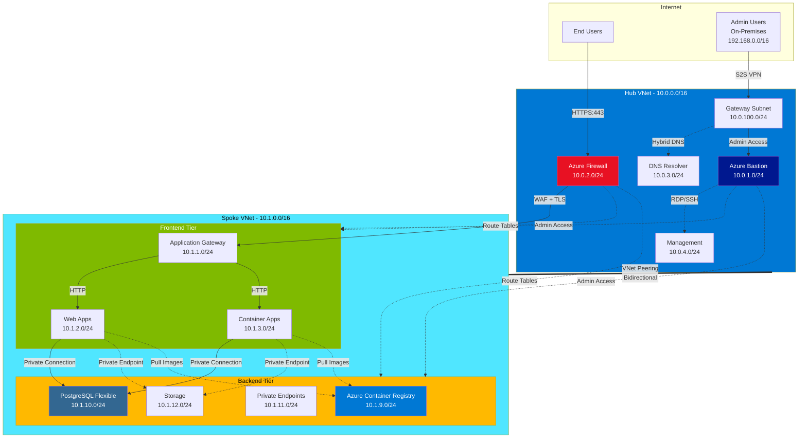

# Hub and Spoke Network Architecture Design

## Overview

This document outlines the hub and spoke network architecture for the Azure Landing Zone, implementing enterprise-grade networking with security, scalability, and performance in mind.

## Network Architecture

## IP Address Allocation

### Hub VNet (10.0.0.0/16)

- **VNet CIDR**: 10.0.0.0/16
- **Azure Bastion Subnet**: 10.0.1.0/24 (AzureBastionSubnet)
- **Azure Firewall Subnet**: 10.0.2.0/24 (AzureFirewallSubnet)
- **DNS Resolver Subnet**: 10.0.3.0/24
- **Management Subnet**: 10.0.4.0/24
- **Gateway Subnet**: 10.0.100.0/24 (GatewaySubnet - for future VPN/ExpressRoute)

### Spoke VNet (10.1.0.0/16)

- **VNet CIDR**: 10.1.0.0/16
- **Application Gateway Subnet**: 10.1.1.0/24
- **Web Apps Subnet**: 10.1.2.0/24 (delegated to Microsoft.Web/serverFarms)
- **Container Apps Subnet**: 10.1.3.0/24 (delegated to Microsoft.App/environments)
- **ACR Private Endpoints Subnet**: 10.1.9.0/24 (for Azure Container Registry)
- **PostgreSQL Flexible Subnet**: 10.1.10.0/24 (delegated to Microsoft.DBforPostgreSQL/flexibleServers)
- **Private Endpoints Subnet**: 10.1.11.0/24
- **Storage Subnet**: 10.1.12.0/24

## Azure Services Architecture

### Hub Services

1. **Azure Bastion** - Secure RDP/SSH connectivity for admin users from on-premises
2. **Azure Firewall** - Network security and filtering for all traffic
3. **DNS Private Resolver** - Hybrid DNS resolution between Azure and on-premises
4. **VPN Gateway** - Site-to-Site VPN connectivity for on-premises admin access
5. **Network Security Groups** - Subnet-level security

### Spoke Services

1. **Application Gateway v2** - WAF, SSL termination, load balancing for end-user traffic
2. **Azure Web App** - PaaS web application hosting with private connectivity
3. **Azure Container App Jobs** - Serverless container workloads
4. **Azure Container Registry** - Private container image registry with VNet integration
5. **Storage Account** - Blob storage with private endpoints
6. **PostgreSQL Flexible Server** - Managed database service with VNet integration
7. **Private Endpoints** - Secure service connectivity for Storage Account and ACR

## Access Patterns

### End User Access

- **Source**: Internet (public)
- **Entry Point**: Azure Firewall → Application Gateway
- **Protocol**: HTTPS:443
- **Target**: Web Apps / Container Apps
- **Security**: WAF protection, TLS encryption, DDoS protection

### Admin Access

- **Source**: On-Premises (192.168.0.0/16)
- **Entry Point**: VPN Gateway → Azure Bastion
- **Protocol**: S2S VPN, then RDP/SSH
- **Target**: Management resources, VMs, backend services
- **Security**: MFA, Conditional Access, Just-in-Time access

## Security Architecture

### Network Security Groups (NSGs)

- **Hub Management NSG**: Allows admin traffic from VPN Gateway only
- **Spoke Application NSG**: HTTPS:443 from Application Gateway, admin access from Bastion
- **Spoke PostgreSQL NSG**: Port 5432 from application subnets only
- **ACR Private Endpoint NSG**: HTTPS:443 from application and container subnets
- **Private Endpoint NSG**: Minimal required access for storage and registry

### Azure Firewall Rules

- **Application Rules**: Allow specific FQDNs for external connectivity
- **Network Rules**: Inter-subnet communication control, end-user HTTPS traffic
- **NAT Rules**: Forward end-user traffic to Application Gateway

### Private DNS Zones

- **privatelink.azurewebsites.net** - Web Apps private endpoint
- **privatelink.blob.core.windows.net** - Storage Account blob endpoint
- **privatelink.postgres.database.azure.com** - PostgreSQL Flexible Server private endpoint
- **privatelink.azurecr.io** - Azure Container Registry private endpoint

## Route Tables

- **Hub Routes**: Force traffic through Azure Firewall for inspection
- **Spoke Application Routes**: Route end-user traffic through hub firewall
- **PostgreSQL Routes**: Direct routing within VNet, restricted to application subnets

## High Availability and Redundancy

- **Multi-zone deployment** where supported (Application Gateway, PostgreSQL)
- **Application Gateway** in multiple availability zones for end-user access resilience
- **PostgreSQL Flexible Server** with zone-redundant high availability configuration
- **Storage Account** with geo-redundant storage (GRS) options
- **VPN Gateway** active-active configuration for on-premises connectivity

## Monitoring and Diagnostics

- **NSG Flow Logs** enabled for all security groups
- **Azure Firewall logs** for traffic analysis (end-user and admin traffic)
- **Application Gateway diagnostics** for performance monitoring and WAF events
- **PostgreSQL Flexible Server diagnostics** for query performance and connection monitoring
- **VPN Gateway diagnostics** for on-premises connectivity monitoring
- **Azure Bastion session logs** for admin access auditing

## Cost Optimization

- **Standard SKU** for non-production workloads (Application Gateway, PostgreSQL)
- **Shared Application Gateway** for multiple applications
- **Storage lifecycle policies** for cost management
- **Container Apps consumption-based billing**
- **PostgreSQL Flexible Server** with burstable SKU for development environments

## Deployment Strategy

1. **Phase 1**: Hub VNet with core networking services (Firewall, Bastion, VPN Gateway, DNS)
2. **Phase 2**: Spoke VNet with basic connectivity and VNet peering
3. **Phase 3**: Application services deployment (Web Apps, Container Apps, PostgreSQL)
4. **Phase 4**: Private endpoints and DNS configuration for secure connectivity
5. **Phase 5**: Security hardening, NSG rules, and access testing (end-user + admin)
