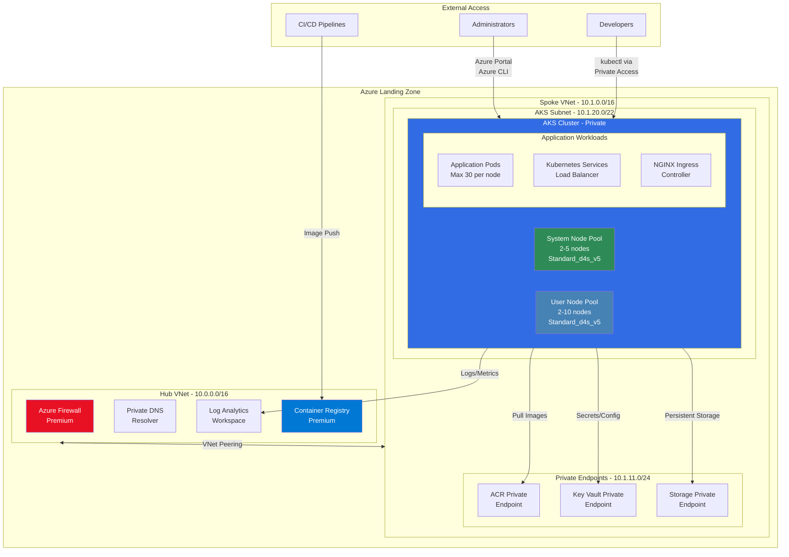

# Azure Kubernetes Service (AKS) Configuration Guide

[](https://docs.microsoft.com/en-us/azure/aks/)
[](https://docs.microsoft.com/en-us/azure/aks/private-clusters)
[](https://docs.microsoft.com/en-us/azure/aks/intro-kubernetes)

## Overview

This document provides comprehensive guidance for deploying and configuring Azure Kubernetes Service (AKS) within the Azure Landing Zone (ALZ) framework. The configuration emphasizes enterprise security, scalability, and policy compliance while maintaining operational efficiency.

## Table of Contents

- [AKS Cluster Architecture](#aks-cluster-architecture)
- [Network Configuration](#network-configuration)
- [Security Configuration](#security-configuration)
- [Node Pool Configuration](#node-pool-configuration)
- [Monitoring and Logging](#monitoring-and-logging)
- [Storage and Persistent Volumes](#storage-and-persistent-volumes)
- [Access Control and RBAC](#access-control-and-rbac)
- [Deployment Configuration](#deployment-configuration)
- [Troubleshooting](#troubleshooting)
- [Best Practices](#best-practices)

## AKS Cluster Architecture

### Current Configuration

```hcl
resource "azurerm_kubernetes_cluster" "main" {
  name                = "aks-${var.organization_prefix}-tf-${var.environment}-${random_string.unique.result}"
  location            = var.location
  resource_group_name = azurerm_resource_group.spoke.name
  dns_prefix          = "aks-${var.organization_prefix}-tf-${var.environment}-${random_string.unique.result}"
  kubernetes_version  = var.aks_kubernetes_version  # 1.30
  sku_tier           = "Free"                       # Cost-optimized for sandbox
}
```

### Architecture Diagram



### Key Features

- **Private Cluster**: No public API server endpoint
- **VNet Integration**: Deployed in dedicated subnet with CNI networking
- **Dual Node Pools**: System and user node pools for workload separation
- **Enterprise Security**: Integration with Azure services through private endpoints
- **Cost Optimized**: Free tier suitable for development and testing

## Network Configuration

### Subnet Allocation

```hcl
resource "azurerm_subnet" "spoke_aks" {
  name                 = "snet-aks"
  resource_group_name  = azurerm_resource_group.spoke.name
  virtual_network_name = azurerm_virtual_network.spoke.name
  address_prefixes     = ["10.1.20.0/22"]  # 1024 IP addresses
}
```

**IP Allocation Breakdown:**

- **Total IPs**: 1024 (10.1.20.0/22)
- **Reserved by Azure**: ~5 IPs per subnet
- **Available for nodes**: ~1019 IPs
- **Max nodes per pool**: 100 (limited by configuration)
- **Pods per node**: 30 (configurable)

### Network Profile Configuration

```hcl
network_profile {
  network_plugin    = "azure"           # Azure CNI for advanced networking
  network_policy    = "azure"           # Azure Network Policy for security
  dns_service_ip    = "10.2.0.10"       # Kubernetes DNS service IP
  service_cidr      = "10.2.0.0/16"     # Kubernetes services CIDR
  load_balancer_sku = "standard"        # Standard Load Balancer for features
  outbound_type     = "loadBalancer"    # Outbound connectivity via LB
}
```

**Network Segmentation:**

- **Node IPs**: From VNet subnet (10.1.20.0/22)
- **Pod IPs**: Allocated from VNet (Azure CNI)
- **Service IPs**: Separate CIDR (10.2.0.0/16)
- **DNS Service**: Single IP for cluster DNS (10.2.0.10)

### Private Cluster Configuration

```hcl
# Private cluster settings
private_cluster_enabled             = true
private_cluster_public_fqdn_enabled = false
private_dns_zone_id                 = "System"  # Azure manages private DNS
```

**Benefits:**

- No public API server endpoint
- Access only through private network
- Integrated with Azure Private DNS
- Enhanced security for enterprise environments

## Security Configuration

### Identity and Access

```hcl
# Managed identity for cluster services
identity {
  type = "SystemAssigned"
}

# RBAC configuration
role_based_access_control_enabled = true
local_account_disabled            = false  # Enable for initial setup
azure_policy_enabled             = false  # Disabled to avoid policy conflicts
```

### Security Features

```hcl
# Security configurations
run_command_enabled    = true   # For troubleshooting (disable in production)
workload_identity_enabled = false  # Disabled initially for compatibility
oidc_issuer_enabled       = false  # Disabled initially for compatibility
```

**Security Hardening Recommendations:**

1. **Production Settings:**

   ```hcl
   local_account_disabled    = true   # Disable local accounts
   run_command_enabled       = false  # Disable run command
   azure_policy_enabled      = true   # Enable Azure Policy
   workload_identity_enabled = true   # Enable workload identity
   ```

2. **Network Security Groups:**

   - Restrict traffic to AKS subnet
   - Allow only required ports (443, 80, 22, 10250)
   - Block unnecessary outbound traffic

3. **Azure Defender Integration:**
   ```hcl
   microsoft_defender {
     log_analytics_workspace_id = azurerm_log_analytics_workspace.main.id
   }
   ```

### Key Vault Integration

```hcl
# Secrets provider for Key Vault
key_vault_secrets_provider {
  secret_rotation_enabled  = true
  secret_rotation_interval = "2m" # pragma: allowlist secret
}
```

**Usage Example:**

```yaml
apiVersion: secrets-store.csi.x-k8s.io/v1
kind: SecretProviderClass
metadata:
  name: app-secrets
spec:
  provider: azure
  parameters:
    usePodIdentity: 'false'
    useVMManagedIdentity: 'true'
    objects: |
      array:
        - |
          objectName: database-password
          objectType: secret
```

## Node Pool Configuration

### System Node Pool (Default)

```hcl
default_node_pool {
  name                         = "system"
  node_count                   = var.aks_system_node_count  # 2
  vm_size                      = var.aks_system_node_size   # Standard_d4s_v5
  vnet_subnet_id               = azurerm_subnet.spoke_aks.id
  type                         = "VirtualMachineScaleSets"

  # Auto-scaling configuration
  auto_scaling_enabled         = true
  min_count                    = 1
  max_count                    = 5

  # Resource allocation
  max_pods                     = 30
  os_disk_size_gb              = 128
  os_disk_type                 = "Managed"
  os_sku                       = "Ubuntu"
  only_critical_addons_enabled = true  # Only system workloads

  # Node configuration
  kubelet_disk_type = "OS"

  node_labels = {
    "nodepool-type" = "system"
    "environment"   = var.environment
    "tier"          = "system"
  }

  upgrade_settings {
    max_surge = "10%"  # Conservative upgrade strategy
  }
}
```

### User Node Pool (Applications)

```hcl
resource "azurerm_kubernetes_cluster_node_pool" "user" {
  count                 = var.enable_aks && var.enable_aks_user_node_pool ? 1 : 0
  name                  = "user"
  kubernetes_cluster_id = azurerm_kubernetes_cluster.main[0].id
  vm_size               = var.aks_user_node_size    # Standard_d4s_v5
  node_count            = var.aks_user_node_count   # 2
  vnet_subnet_id        = azurerm_subnet.spoke_aks.id

  # Auto-scaling for application workloads
  auto_scaling_enabled = true
  min_count            = 1
  max_count            = 10
  max_pods             = 30

  # Storage configuration
  os_disk_size_gb   = 128
  os_disk_type      = "Managed"
  os_type           = "Linux"
  os_sku            = "Ubuntu"
  kubelet_disk_type = "OS"

  node_labels = {
    "nodepool-type" = "user"
    "environment"   = var.environment
    "nodepoolos"    = "linux"
  }

  upgrade_settings {
    max_surge = "33%"  # Faster upgrades for user workloads
  }
}
```

### VM Size Recommendations

| **Environment** | **System Pool** | **User Pool**    | **Justification**                      |
| --------------- | --------------- | ---------------- | -------------------------------------- |
| **Development** | Standard_d2s_v5 | Standard_d2s_v5  | Cost-optimized, sufficient for testing |
| **Test**        | Standard_d4s_v5 | Standard_d4s_v5  | Balanced performance and cost          |
| **Production**  | Standard_d4s_v5 | Standard_d8s_v5+ | High performance, enterprise workloads |

**Approved VM Sizes (Policy Compliant):**

- Dsv5 Series: Standard_d2s_v5, Standard_d4s_v5, Standard_d8s_v5, Standard_d16s_v5, Standard_d32s_v5
- Ddsv5 Series: Standard_d2ds_v5, Standard_d4ds_v5, Standard_d8ds_v5, Standard_d16ds_v5, Standard_d32ds_v5

### Auto-Scaler Configuration

```hcl
auto_scaler_profile {
  balance_similar_node_groups      = false
  expander                         = "random"
  max_graceful_termination_sec     = 600
  max_node_provisioning_time       = "15m"
  new_pod_scale_up_delay           = "0s"
  scale_down_delay_after_add       = "10m"
  scale_down_delay_after_delete    = "10s"
  scale_down_delay_after_failure   = "3m"
  scan_interval                    = "10s"
  scale_down_unneeded              = "10m"
  scale_down_unready               = "20m"
  scale_down_utilization_threshold = 0.5
}
```

**Scaling Behavior:**

- **Scale Up**: Immediate when needed
- **Scale Down**: Conservative (10 min delay)
- **Utilization Threshold**: 50% for scale-down decisions
- **Max Provision Time**: 15 minutes before timeout

## Monitoring and Logging

### Azure Monitor Integration

```hcl
# Container Insights integration
oms_agent {
  log_analytics_workspace_id      = azurerm_log_analytics_workspace.main.id
  msi_auth_for_monitoring_enabled = true
}
```

**Key Metrics Collected:**

- Container CPU and memory usage
- Node resource utilization
- Pod scheduling and performance
- Network traffic patterns
- Application logs and events

### Log Analytics Workspace

**Workspace Configuration:**

```hcl
resource "azurerm_log_analytics_workspace" "main" {
  name                = "log-${var.organization_prefix}-tf-hub-${var.environment}"
  resource_group_name = azurerm_resource_group.hub.name
  location            = var.location
  sku                 = "PerGB2018"
  retention_in_days   = 30  # Sandbox retention
}
```

**Key Log Tables:**

- `ContainerLog`: Application and system container logs
- `KubeEvents`: Kubernetes events and scheduling
- `KubePodInventory`: Pod lifecycle and resource usage
- `KubeNodeInventory`: Node health and resource allocation
- `ContainerInventory`: Container image and runtime information

### Monitoring Queries

**High CPU Usage:**

```kql
Perf
| where TimeGenerated > ago(1h)
| where ObjectName == "K8SContainer"
| where CounterName == "cpuUsageNanoCores"
| where InstanceName contains "user"
| summarize avg(CounterValue) by bin(TimeGenerated, 5m), InstanceName
| render timechart
```

**Pod Resource Usage:**

```kql
KubePodInventory
| where TimeGenerated > ago(1h)
| where Namespace != "kube-system"
| project TimeGenerated, Name, Namespace, PodStatus, PodCreationTime
| summarize count() by bin(TimeGenerated, 10m), Namespace
| render columnchart
```

## Storage and Persistent Volumes

### Storage Classes

**Default Storage Classes:**

- `default`: Standard_LRS managed disks
- `managed-premium`: Premium_LRS managed disks
- `azurefile`: Azure Files for shared storage
- `azurefile-premium`: Premium Azure Files

**Custom Storage Class Example:**

```yaml
apiVersion: storage.k8s.io/v1
kind: StorageClass
metadata:
  name: fast-ssd
parameters:
  skuName: Premium_LRS
  location: westeurope
  storageAccount: stalztfsandbox12345
provisioner: disk.csi.azure.com
reclaimPolicy: Delete
volumeBindingMode: WaitForFirstConsumer
```

### Persistent Volume Example

```yaml
apiVersion: v1
kind: PersistentVolumeClaim
metadata:
  name: app-storage
spec:
  accessModes:
    - ReadWriteOnce
  storageClassName: managed-premium
  resources:
    requests:
      storage: 100Gi
```

### Azure Files Integration

```yaml
apiVersion: v1
kind: PersistentVolumeClaim
metadata:
  name: shared-storage
spec:
  accessModes:
    - ReadWriteMany
  storageClassName: azurefile
  resources:
    requests:
      storage: 100Gi
```

## Access Control and RBAC

### Azure RBAC Integration

**Current Configuration:**

```hcl
# Simplified RBAC (Azure AD integration disabled initially)
role_based_access_control_enabled = true
local_account_disabled            = false
```

**Production RBAC Configuration:**

```hcl
azure_active_directory_role_based_access_control {
  admin_group_object_ids = var.aks_admin_group_object_ids
  azure_rbac_enabled     = true
}
```

### Role Assignment for ACR

```hcl
resource "azurerm_role_assignment" "aks_acr_pull" {
  count                = var.enable_aks && var.enable_container_registry ? 1 : 0
  scope                = azurerm_container_registry.main[0].id
  role_definition_name = "AcrPull"
  principal_id         = azurerm_kubernetes_cluster.main[0].kubelet_identity[0].object_id
}
```

**Benefits:**

- AKS can pull images from Azure Container Registry
- No credentials needed in manifests
- Managed identity authentication
- Least privilege access

### Kubernetes RBAC Examples

**Namespace-scoped Role:**

```yaml
apiVersion: rbac.authorization.k8s.io/v1
kind: Role
metadata:
  namespace: production
  name: pod-reader
rules:
  - apiGroups: ['']
    resources: ['pods']
    verbs: ['get', 'watch', 'list']
```

**Cluster-scoped RoleBinding:**

```yaml
apiVersion: rbac.authorization.k8s.io/v1
kind: ClusterRoleBinding
metadata:
  name: aks-admin-binding
subjects:
  - kind: User
    name: admin@company.com
    apiGroup: rbac.authorization.k8s.io
roleRef:
  kind: ClusterRole
  name: cluster-admin
  apiGroup: rbac.authorization.k8s.io
```

## Deployment Configuration

### Terraform Variables

```hcl
# AKS Configuration variables
variable "enable_aks" {
  description = "Enable Azure Kubernetes Service in spoke"
  type        = bool
  default     = true
}

variable "aks_kubernetes_version" {
  description = "Kubernetes version for AKS cluster"
  type        = string
  default     = "1.30"

  validation {
    condition     = can(regex("^1\\.(2[4-9]|[3-9][0-9])$", var.aks_kubernetes_version))
    error_message = "Kubernetes version must be 1.24 or higher."
  }
}

variable "aks_system_node_count" {
  description = "Number of nodes in the system node pool"
  type        = number
  default     = 2

  validation {
    condition     = var.aks_system_node_count >= 1 && var.aks_system_node_count <= 5
    error_message = "System node count must be between 1 and 5."
  }
}

variable "aks_system_node_size" {
  description = "VM size for system node pool"
  type        = string
  default     = "Standard_d4s_v5"
}
```

### terraform.tfvars Configuration

```hcl
# Basic configuration
location        = "westeurope"
environment     = "sandbox"
organization_prefix = "alz"

# AKS configuration
enable_aks                 = true
aks_kubernetes_version     = "1.30"
aks_system_node_count      = 2
aks_system_node_size       = "Standard_d4s_v5"
enable_aks_user_node_pool  = true
aks_user_node_count        = 2
aks_user_node_size         = "Standard_d4s_v5"

# Supporting services
enable_container_registry  = true
enable_app_workloads      = true
```

### Deployment Commands

```bash
# Navigate to Terraform foundation
cd blueprints/terraform/foundation

# Initialize Terraform
terraform init

# Plan deployment
terraform plan -var-file="terraform.tfvars" -out="tfplan"

# Apply configuration
terraform apply tfplan

# Get AKS credentials
az aks get-credentials \
  --resource-group rg-alz-tf-spoke-sandbox \
  --name aks-alz-tf-sandbox-12345678
```

### Post-Deployment Verification

```bash
# Check cluster status
kubectl cluster-info

# Verify node pools
kubectl get nodes -o wide

# Check system pods
kubectl get pods -n kube-system

# Verify storage classes
kubectl get storageclass

# Test private endpoint connectivity
kubectl run test-pod --image=nginx --restart=Never
kubectl exec test-pod -- nslookup acralztfsandbox12345.azurecr.io
kubectl delete pod test-pod
```

## Troubleshooting

### Common Issues

#### 1. Private Cluster Access

**Problem:** Cannot access AKS API server

```bash
error: You must be logged in to the server (Unauthorized)
```

**Solution:**

```bash
# Verify you're connected to the VNet
az aks get-credentials --resource-group rg-alz-tf-spoke-sandbox --name aks-cluster-name

# Check private DNS resolution
nslookup aks-cluster-name-dns-12345678.hcp.westeurope.azmk8s.io

# Alternative: Use Azure Cloud Shell (has network access)
```

#### 2. Node Pool Scaling Issues

**Problem:** Nodes not scaling up/down as expected

**Diagnostics:**

```bash
# Check cluster autoscaler logs
kubectl logs -n kube-system deployment/cluster-autoscaler

# Verify node pool configuration
az aks nodepool show --cluster-name aks-cluster --name user --resource-group rg-name

# Check resource quotas
kubectl describe quota --all-namespaces
```

#### 3. Container Registry Access

**Problem:** ImagePullBackOff errors

**Solution:**

```bash
# Verify ACR integration
az aks check-acr --name aks-cluster --resource-group rg-spoke --acr acr-name

# Check RBAC permissions
az role assignment list --scope /subscriptions/sub-id/resourceGroups/rg-hub/providers/Microsoft.ContainerRegistry/registries/acr-name
```

#### 4. Network Connectivity Issues

**Problem:** Pods cannot reach external services

**Diagnostics:**

```bash
# Check network policies
kubectl get networkpolicies --all-namespaces

# Test DNS resolution
kubectl run test-dns --image=busybox --restart=Never -- nslookup google.com
kubectl logs test-dns
kubectl delete pod test-dns

# Verify outbound connectivity
kubectl run test-connectivity --image=curlimages/curl --restart=Never -- curl -I https://google.com
```

### Performance Optimization

#### Node Pool Optimization

```bash
# Check node resource usage
kubectl top nodes

# Identify resource-hungry pods
kubectl top pods --all-namespaces --sort-by=cpu
kubectl top pods --all-namespaces --sort-by=memory

# Optimize node pool configuration
az aks nodepool update \
  --cluster-name aks-cluster \
  --name user \
  --resource-group rg-spoke \
  --max-pods 50 \
  --enable-cluster-autoscaler \
  --min-count 2 \
  --max-count 20
```

#### Resource Requests and Limits

```yaml
apiVersion: apps/v1
kind: Deployment
metadata:
  name: optimized-app
spec:
  replicas: 3
  selector:
    matchLabels:
      app: optimized-app
  template:
    metadata:
      labels:
        app: optimized-app
    spec:
      containers:
        - name: app
          image: nginx
          resources:
            requests:
              cpu: 100m # 0.1 CPU
              memory: 128Mi # 128 MB
            limits:
              cpu: 500m # 0.5 CPU
              memory: 512Mi # 512 MB
```

## Best Practices

### Security Best Practices

1. **Private Cluster Configuration**

   - Always use private clusters for production
   - Implement network segmentation
   - Use Azure Private DNS for resolution

2. **Identity and Access Management**

   - Enable Azure AD integration
   - Use managed identities for service authentication
   - Implement least privilege RBAC
   - Regular access reviews

3. **Network Security**

   - Implement Network Security Groups
   - Use Azure Firewall for outbound filtering
   - Deploy network policies for pod-to-pod communication
   - Regular vulnerability scanning

4. **Image Security**
   - Use trusted base images
   - Implement image scanning in CI/CD
   - Store images in private registry
   - Enable content trust

### Operational Best Practices

1. **Resource Management**

   - Always set resource requests and limits
   - Use horizontal pod autoscaling
   - Implement pod disruption budgets
   - Monitor resource utilization

2. **Deployment Strategies**

   - Use rolling updates for deployments
   - Implement health checks (liveness/readiness probes)
   - Use namespaces for environment separation
   - Version control all Kubernetes manifests

3. **Monitoring and Logging**

   - Enable Container Insights
   - Implement centralized logging
   - Set up alerting for critical metrics
   - Regular cluster health checks

4. **Backup and Recovery**
   - Backup persistent volumes
   - Document disaster recovery procedures
   - Test restoration processes
   - Implement cluster backup strategies

### Cost Optimization

1. **Node Pool Management**

   - Use appropriate VM sizes for workloads
   - Enable cluster autoscaler
   - Consider spot instances for non-critical workloads
   - Regular rightsizing reviews

2. **Resource Efficiency**

   - Implement resource quotas per namespace
   - Use vertical pod autoscaling
   - Optimize image sizes
   - Monitor and eliminate unused resources

3. **Reserved Instances**
   - Purchase reserved instances for predictable workloads
   - Use Azure Hybrid Benefit for Windows nodes
   - Consider savings plans for flexible workloads

## Conclusion

This AKS configuration provides a solid foundation for enterprise Kubernetes deployments within the Azure Landing Zone framework. The configuration balances security, performance, and cost while maintaining flexibility for different environments.

**Key Takeaways:**

- Private cluster configuration ensures enterprise security
- Dual node pools separate system and application workloads
- Integration with Azure services provides seamless authentication and monitoring
- Auto-scaling capabilities ensure optimal resource utilization
- Comprehensive monitoring enables proactive operational management

For additional support and advanced configurations, refer to the [Azure AKS Documentation](https://docs.microsoft.com/en-us/azure/aks/) and the [Kubernetes Documentation](https://kubernetes.io/docs/).

---

**Related Documents:**

- [Hub-Spoke Design](hub-spoke-design.md) - Overall network architecture
- [AVM Deployment Guide](avm-deployment-guide.md) - Complete deployment walkthrough
- [Cost Optimization Guide](cost-estimation-guide.md) - Cost management strategies
- [Security Best Practices](azure-sandbox-policies-overview.md) - Security guidelines
