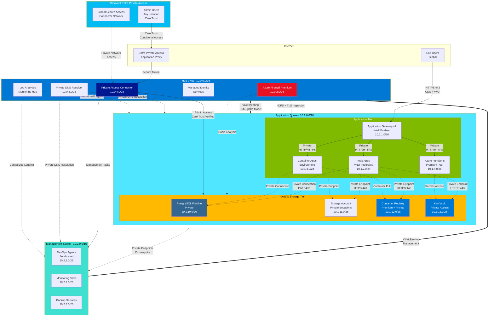

# Hub and Spoke Network Architecture Design (Updated 2025)

## Overview

This document outlines the modern hub and spoke network architecture for the Azure Landing Zone, implementing Zero Trust networking with Entra Private Access, eliminating the need for traditional VPN connections and Azure Bastion. This design leverages the latest AVM modules and modern security patterns.

## Modern Network Architecture



## Optimized IP Address Allocation

### Hub VNet (10.0.0.0/16) - Centralized Services

- **VNet CIDR**: 10.0.0.0/16 (65,536 addresses)
- **Azure Firewall Subnet**: 10.0.2.0/26 (62 usable IPs - AzureFirewallSubnet)
- **Private DNS Resolver**: 10.0.3.0/28 (14 usable IPs)
- **Private Access Connector**: 10.0.4.0/28 (14 usable IPs - Entra Private Access)
- **Shared Services**: 10.0.5.0/24 (254 IPs - Log Analytics, Key Vault, etc.)
- **Reserved for Expansion**: 10.0.16.0/20 (4,094 IPs for future hub services)

### Application Spoke VNet (10.1.0.0/16) - Workload Tier

- **VNet CIDR**: 10.1.0.0/16 (65,536 addresses)
- **Application Gateway Subnet**: 10.1.1.0/26 (62 usable IPs)
- **Web Apps Subnet**: 10.1.2.0/24 (254 IPs - delegated to Microsoft.Web/serverFarms)
- **Container Apps Subnet**: 10.1.3.0/24 (254 IPs - delegated to Microsoft.App/environments)
- **Functions Subnet**: 10.1.4.0/26 (62 IPs - delegated to Microsoft.Web/serverFarms)
- **PostgreSQL Flexible Subnet**: 10.1.10.0/26 (62 IPs - delegated to Microsoft.DBforPostgreSQL/flexibleServers)
- **Storage Private Endpoints**: 10.1.11.0/26 (62 IPs for private endpoints)
- **ACR Private Endpoints**: 10.1.12.0/28 (14 IPs for container registry)
- **Key Vault Private Endpoints**: 10.1.13.0/28 (14 IPs for secrets access)
- **Reserved for App Expansion**: 10.1.16.0/20 (4,094 IPs for future app services)

### Management Spoke VNet (10.2.0.0/16) - Operations Tier

- **VNet CIDR**: 10.2.0.0/16 (65,536 addresses)
- **DevOps Agents Subnet**: 10.2.1.0/26 (62 IPs - self-hosted runners)
- **Monitoring Tools Subnet**: 10.2.2.0/26 (62 IPs - Grafana, Prometheus, etc.)
- **Backup Services Subnet**: 10.2.3.0/26 (62 IPs - Azure Backup, recovery services)
- **Reserved for Ops Expansion**: 10.2.16.0/20 (4,094 IPs for future management services)

## Modern Azure Services Architecture (AVM-Based)

### Hub Services (Centralized)

#### Core Network Services

1. **Azure Firewall Premium** (AVM: `avm/res/network/azure-firewall`)

   - IDPS (Intrusion Detection and Prevention System)
   - TLS inspection for encrypted traffic
   - Web filtering and threat intelligence
   - Network and application rule processing

2. **Private DNS Resolver** (AVM: `avm/res/network/private-dns-resolver`)

   - Private DNS resolution within VNet
   - Conditional forwarding for hybrid scenarios
   - No public DNS exposure

3. **Microsoft Entra Private Access Connector** (AVM: Custom deployment)
   - Zero Trust network access for administrators
   - Replaces traditional VPN and Bastion
   - Integration with Conditional Access policies
   - Identity-based access control

#### Shared Services

4. **Log Analytics Workspace** (AVM: `avm/res/operational-insights/workspace`)

   - Centralized logging and monitoring
   - Security event correlation
   - Performance analytics
   - Cost optimization insights

5. **Managed Identity Services** (AVM: `avm/res/managed-identity/user-assigned-identity`)
   - Service-to-service authentication
   - Secrets management without credentials
   - Azure RBAC integration

### Application Spoke Services (Workloads)

#### Compute Services

1. **Application Gateway v2** (AVM: `avm/res/network/application-gateway`)

   - WAF v2 with OWASP top 10 protection
   - SSL/TLS termination with managed certificates
   - Multi-site hosting and path-based routing
   - Zone redundancy for high availability

2. **Azure Web Apps** (AVM: `avm/res/web/site`)

   - VNet integration for private communication
   - Managed identity for secure resource access
   - Deployment slots for blue-green deployments
   - Auto-scaling based on demand

3. **Azure Container Apps** (AVM: `avm/res/app/container-app`)

   - Serverless containers with KEDA autoscaling
   - VNet integration and private endpoints
   - Dapr integration for microservices
   - Built-in load balancing and service discovery

4. **Azure Functions Premium** (AVM: `avm/res/web/site`)
   - VNet integration for private networking
   - Durable Functions for stateful workflows
   - Event-driven processing
   - Cold start elimination with pre-warmed instances

#### Data Services

5. **PostgreSQL Flexible Server** (AVM: `avm/res/db-for-postgreSQL/flexible-server`)

   - Private networking with VNet integration
   - High availability with zone redundancy
   - Automated backups and point-in-time restore
   - Performance insights and query optimization

6. **Azure Storage Account** (AVM: `avm/res/storage/storage-account`)

   - Private endpoints for secure access
   - Blob storage with lifecycle management
   - Table storage for application data
   - Queue storage for asynchronous processing

7. **Azure Container Registry Premium** (AVM: `avm/res/container-registry/registry`)

   - Private endpoints for secure image pulls
   - Geo-replication for disaster recovery
   - Image scanning for vulnerability assessment
   - Content trust for image integrity

8. **Azure Key Vault** (AVM: `avm/res/key-vault/vault`)
   - Private endpoints for secrets access
   - Hardware Security Module (HSM) support
   - Certificate management and auto-rotation
   - Integration with managed identities

### Management Spoke Services (Operations)

#### DevOps Services

1. **Self-hosted DevOps Agents** (AVM: `avm/res/compute/virtual-machine`)

   - Private network deployment agents
   - Container-based runners for scalability
   - Managed identity for Azure resource access
   - Auto-scaling based on build queue

2. **Monitoring and Observability**

   - **Azure Monitor** (AVM: `avm/res/insights/component`)
   - **Application Insights** for application telemetry
   - **Grafana** for custom dashboards
   - **Prometheus** for metrics collection

3. **Backup and Recovery** (AVM: `avm/res/recovery-services/vault`)
   - Azure Backup for VM and database protection
   - Site Recovery for disaster recovery
   - Cross-region replication
   - Automated backup policies

## Modern Access Patterns (Zero Trust)

### End User Access (Public Applications)

- **Source**: Internet (global users)
- **Entry Point**: Azure CDN → Application Gateway v2
- **Protocol**: HTTPS:443 with HTTP/2 and TLS 1.3
- **Target**: Web Apps, Container Apps, Functions
- **Security Features**:
  - WAF v2 with OWASP top 10 protection
  - DDoS Protection Standard
  - TLS encryption end-to-end
  - Rate limiting and geo-filtering
  - Bot protection and threat intelligence

### Administrator Access (Zero Trust Model)

- **Source**: Any location (work from anywhere)
- **Entry Point**: Microsoft Entra Private Access
- **Authentication Flow**:
  1. User authenticates to Entra ID with MFA
  2. Conditional Access policies evaluate device/location/risk
  3. Private Access Connector establishes secure tunnel
  4. Admin accesses private resources without VPN
- **Protocol**: HTTPS over secure tunnel (no VPN client needed)
- **Target**: Private endpoints, management interfaces, databases
- **Security Features**:
  - Identity-based access control
  - Device compliance verification
  - Session recording and monitoring
  - Just-in-Time access for elevated privileges
  - Zero Trust network access (ZTNA)

### Application-to-Application Access (Service Communication)

- **Source**: Azure services within the landing zone
- **Authentication**: Managed Identity with Azure RBAC
- **Communication**: Private endpoints and VNet integration
- **Target**: Databases, storage, container registries, key vaults
- **Security Features**:
  - No credentials stored in application code
  - Network isolation with private networking
  - Encrypted communication (TLS 1.3)
  - Least privilege access policies

### DevOps Access (CI/CD Pipelines)

- **Source**: GitHub Actions, Azure DevOps, self-hosted agents
- **Authentication**: Service principals with federated credentials
- **Communication**: Private endpoints and managed identities
- **Target**: Azure resources, container registries, key vaults
- **Security Features**:
  - Workload identity federation (no long-lived secrets)
  - Deployment coordination locks (prevents conflicts)
  - Audit logging for all deployment activities
  - Environment-based access controls

## Zero Trust Security Architecture

### Identity and Access Management (Entra ID)

- **Multi-Factor Authentication (MFA)**: Required for all administrative access
- **Conditional Access Policies**: Device compliance, location, and risk-based access
- **Privileged Identity Management (PIM)**: Just-in-time elevation for sensitive operations
- **Managed Identities**: Service-to-service authentication without credentials
- **Workload Identity Federation**: Secure CI/CD without long-lived secrets

### Network Security (Defense in Depth)

#### Network Security Groups (NSGs) - AVM: `avm/res/network/network-security-group`

- **Hub Firewall NSG**: Minimal rules for Azure Firewall subnet
- **Hub Connector NSG**: Private Access Connector communication
- **App Gateway NSG**: HTTPS:443 from Internet, health probes
- **Web Apps NSG**: HTTP from Application Gateway, private endpoint access
- **Container Apps NSG**: Container communication, private endpoints
- **Functions NSG**: Event-driven access, Key Vault integration
- **PostgreSQL NSG**: Port 5432 from application subnets only (deny all others)
- **Private Endpoints NSG**: HTTPS:443 from authorized subnets only

#### Azure Firewall Premium Rules - AVM: `avm/res/network/azure-firewall`

- **Application Rules**:
  - Allow specific FQDNs for container image pulls
  - External API access with URL filtering
  - Package manager access (npm, NuGet, pip)
- **Network Rules**:
  - Inter-spoke communication control
  - DNS resolution (port 53)
  - NTP synchronization (port 123)
- **IDPS Rules**:
  - Signature-based threat detection
  - TLS inspection for encrypted threats
  - Anomaly detection for unusual traffic patterns

### Private Networking (Zero Public Exposure)

#### Private DNS Zones - AVM: `avm/res/network/private-dns-zone`

- **privatelink.azurewebsites.net** - Web Apps private endpoints
- **privatelink.postgres.database.azure.com** - PostgreSQL Flexible Server
- **privatelink.blob.core.windows.net** - Storage Account blob endpoints
- **privatelink.file.core.windows.net** - Storage Account file shares
- **privatelink.azurecr.io** - Azure Container Registry
- **privatelink.vaultcore.azure.net** - Key Vault private endpoints
- **privatelink.monitor.azure.com** - Azure Monitor private endpoints

#### Private Endpoints - AVM: `avm/res/network/private-endpoint`

- **Storage Account**: Blob, File, Queue, Table endpoints
- **Key Vault**: Secrets, keys, certificates access
- **Container Registry**: Secure image pulls
- **PostgreSQL**: Database connectivity
- **Azure Monitor**: Telemetry and logging

### Data Protection and Encryption

- **Encryption at Rest**: All storage services use Microsoft-managed or customer-managed keys
- **Encryption in Transit**: TLS 1.3 for all communications
- **Database Encryption**: Transparent Data Encryption (TDE) for PostgreSQL
- **Application-level Encryption**: Sensitive data encrypted before storage
- **Key Management**: Azure Key Vault with HSM support

## Route Tables - AVM: `avm/res/network/route-table`

### Hub Route Table

- **Default Route (0.0.0.0/0)**: Route all traffic through Azure Firewall
- **Spoke Networks**: Direct routing to peered VNets
- **Private Endpoints**: Local VNet routing for private connectivity

### Application Spoke Route Tables

- **Internet Traffic**: Route through hub Azure Firewall (0.0.0.0/0 → 10.0.2.4)
- **Hub Services**: Direct routing to hub VNet (10.0.0.0/16)
- **Management Spoke**: Route through hub for cross-spoke communication
- **Local VNet**: Direct routing for intra-VNet traffic

### Management Spoke Route Tables

- **Internet Traffic**: Route through hub Azure Firewall for security scanning
- **Application Spoke**: Direct routing for management tasks
- **Private DNS**: Route through hub DNS resolver

## High Availability and Resilience

### Zone Redundancy - AVM: Built-in zone awareness

- **Application Gateway v2**: Zone-redundant deployment across 3 AZs
- **Azure Firewall Premium**: Zone-redundant for maximum uptime
- **PostgreSQL Flexible Server**: Zone-redundant high availability
- **Storage Accounts**: Zone-redundant storage (ZRS) for critical data
- **Azure Functions Premium**: Multi-zone deployment

### Cross-Region Resilience

- **Container Registry**: Geo-replication to secondary region
- **Storage Account**: Geo-redundant storage (GRS) for disaster recovery
- **Key Vault**: Cross-region backup and recovery
- **Azure Backup**: Cross-region restore capabilities

### Application-Level Resilience

- **Web Apps**: Multiple instances with auto-scaling
- **Container Apps**: KEDA-based scaling with multiple replicas
- **Functions**: Premium plan with pre-warmed instances
- **Database**: Automated backups with point-in-time restore

## Comprehensive Monitoring and Observability

### Network Monitoring - AVM: `avm/res/network/network-watcher`

- **NSG Flow Logs**: All network security groups with Traffic Analytics
- **Azure Firewall Workbook**: Traffic analysis and threat intelligence
- **Application Gateway Metrics**: Performance and WAF events
- **Private Endpoint Monitoring**: Connection status and performance
- **VNet Flow Logs**: Comprehensive network traffic analysis

### Application Monitoring - AVM: `avm/res/insights/component`

- **Application Insights**: End-to-end application performance monitoring
- **Log Analytics**: Centralized logging with KQL queries
- **Azure Monitor Alerts**: Proactive alerting on key metrics
- **Grafana Dashboards**: Custom visualization and analytics
- **Prometheus Metrics**: Container and microservices monitoring

### Security Monitoring

- **Microsoft Sentinel**: SIEM with threat detection and response
- **Defender for Cloud**: Security posture management
- **Entra ID Audit Logs**: Identity and access monitoring
- **Key Vault Audit Logs**: Secrets and certificate access tracking

## Cost Optimization Strategies

### Compute Optimization

- **Container Apps**: Consumption-based billing with scale-to-zero
- **Functions Premium**: Pay for execution time + pre-warmed instances
- **Web Apps**: Standard tier for dev/test, Premium for production
- **PostgreSQL Flexible**: Burstable SKU for variable workloads

### Storage Optimization

- **Lifecycle Management**: Automated tiering to cool/archive storage
- **Blob Storage Tiers**: Hot for active data, cool for infrequent access
- **Managed Disks**: Standard SSD for non-critical workloads
- **Backup Optimization**: Incremental backups with compression

### Network Optimization

- **Shared Application Gateway**: Multiple applications on single instance
- **Private Endpoints**: Reduce data egress charges
- **Azure Firewall**: Shared across multiple spokes
- **DNS Resolver**: Centralized for all spokes

### Monitoring-Driven Optimization

- **Cost Management**: Automated budgets and alerts
- **Advisor Recommendations**: AI-powered cost optimization suggestions
- **Reserved Instances**: Long-term commitments for predictable workloads
- **Azure Hybrid Benefit**: License optimization for Windows/SQL

## Modern Deployment Strategy (AVM-Based)

### Phase 1: Foundation (Hub Infrastructure)

```bash
# Deploy coordination infrastructure first
./scripts/setup-keyvault-cicd.sh

# Hub VNet with core services using AVM modules
az deployment sub create \
  --template-file infra/bicep/hub/main.bicep \
  --parameters @infra/bicep/hub/main.parameters.json
```

**Components:**

- Hub VNet with optimized subnets
- Azure Firewall Premium with IDPS
- Private DNS Resolver
- Entra Private Access Connector
- Log Analytics Workspace
- Shared services (Key Vault, managed identities)

### Phase 2: Application Infrastructure (Spoke 1)

```bash
# Application spoke with compute services
az deployment sub create \
  --template-file infra/bicep/spoke-app/main.bicep \
  --parameters @infra/bicep/spoke-app/main.parameters.json
```

**Components:**

- Application VNet with VNet peering to hub
- Application Gateway v2 with WAF
- Web Apps with VNet integration
- Container Apps environment
- Azure Functions Premium

### Phase 3: Data Services (Private Networking)

```bash
# Data tier with private endpoints
az deployment sub create \
  --template-file infra/bicep/data-services/main.bicep \
  --parameters @infra/bicep/data-services/main.parameters.json
```

**Components:**

- PostgreSQL Flexible Server with private networking
- Storage Account with private endpoints
- Container Registry Premium with private access
- Key Vault with private endpoints
- Private DNS zones and records

### Phase 4: Management Infrastructure (Spoke 2)

```bash
# Management spoke for operations
az deployment sub create \
  --template-file infra/bicep/spoke-mgmt/main.bicep \
  --parameters @infra/bicep/spoke-mgmt/main.parameters.json
```

**Components:**

- Management VNet with cross-spoke connectivity
- Self-hosted DevOps agents
- Monitoring and observability tools
- Backup and recovery services

### Phase 5: Security Hardening and Testing

```bash
# Security configuration and validation
./scripts/validate-security-config.sh
./scripts/test-private-access.sh
./scripts/verify-zero-trust-compliance.sh
```

**Activities:**

- NSG rule validation and optimization
- Private endpoint connectivity testing
- Entra Private Access configuration
- Security baseline compliance verification
- Performance and cost optimization

### CI/CD Integration

```bash
# Automated deployment coordination (prevents conflicts)
./scripts/deployment-coordinator.sh acquire github sandbox

# Deploy using coordinated pipelines
# GitHub Actions: Bicep templates
# Azure DevOps: Terraform infrastructure

# Automated release after successful deployment
./scripts/deployment-coordinator.sh release github sandbox
```

## AVM Module Dependencies

This architecture leverages the following Azure Verified Modules:

### Network Modules

- `avm/res/network/virtual-network` - Hub and spoke VNets
- `avm/res/network/azure-firewall` - Premium firewall with IDPS
- `avm/res/network/application-gateway` - WAF v2 with zone redundancy
- `avm/res/network/private-dns-zone` - Private DNS resolution
- `avm/res/network/private-endpoint` - Secure service connectivity

### Compute Modules

- `avm/res/web/site` - Web Apps and Functions
- `avm/res/app/container-app` - Serverless containers
- `avm/res/compute/virtual-machine` - DevOps agents

### Data Modules

- `avm/res/db-for-postgreSQL/flexible-server` - Managed database
- `avm/res/storage/storage-account` - Blob and file storage
- `avm/res/container-registry/registry` - Container images
- `avm/res/key-vault/vault` - Secrets and certificates

### Identity and Security Modules

- `avm/res/managed-identity/user-assigned-identity` - Service authentication
- `avm/res/operational-insights/workspace` - Centralized logging
- `avm/res/insights/component` - Application monitoring

**🎯 Success Metrics:**

- Zero public IP addresses for backend services
- 100% private endpoint connectivity
- <30 second deployment coordination
- 99.9% application availability
- Zero Trust compliance score >90%
